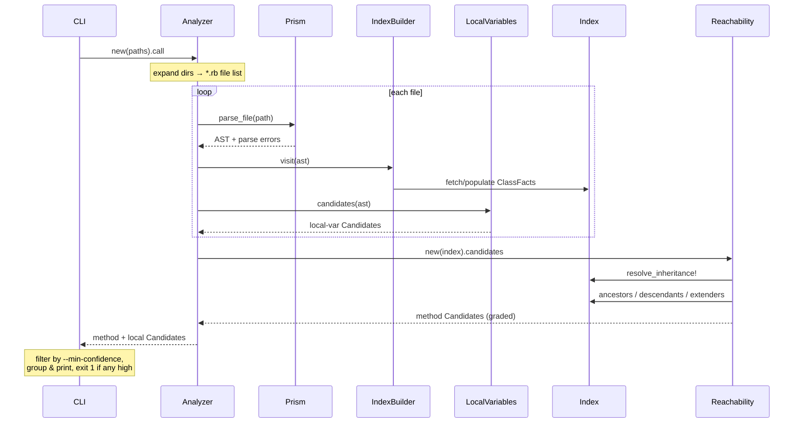
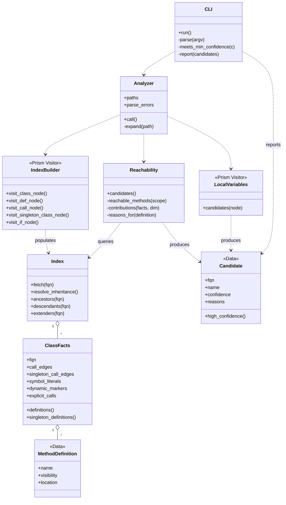

# Thanatos — Architecture

Thanatos is a **deterministic static analyser** that finds unused code in Ruby /
Rails: unused non-public methods (`private`/`protected`, both instance and class
methods) and unused local variables. It parses with [Prism](https://github.com/ruby/prism)
and reasons over a per-constant call graph.

The whole tool rests on one idea:

> A non-public method is dead unless a **live** method reaches it. "Live" starts
> at a set of **roots** (load-time code, public methods, runtime hooks) and flows
> along call edges. This is **reachability from roots**, not "does anything call
> it" — so dead clusters and mutual recursion can't keep each other alive.

Everything below is built so that reachability is computed honestly and the
remaining ambiguity (dynamic dispatch) is *graded*, never silently resolved.

---

## 1. Pipeline

```
paths ─▶ Analyzer ─┬─▶ Prism.parse_file ──▶ IndexBuilder.visit ──▶ Index (ClassFacts…)
                   │                                                    │
                   └─▶ LocalVariables.candidates                        ▼
                                    │                       Index.resolve_inheritance!
                                    │                                    │
                                    │                                    ▼
                                    │                        Reachability.candidates
                                    ▼                                    │
                              local Candidates ───────────┬─────────────┘
                                                          ▼
                                                  CLI.report / exit code
```

The CLI is the entry point; the `Analyzer` is the orchestrator; the `Index` is the
shared model; `IndexBuilder`, `Reachability`, and `LocalVariables` are the three
passes that build it, query it, and run a parallel lexical analysis.

### Sequence



### Structure



---

## 2. Objects, responsibilities, and the business logic each encodes

### `Thanatos` — [lib/thanatos.rb](../lib/thanatos.rb)
The require graph and a convenience `Thanatos.analyze(*paths)`. No logic.

### `CLI` — [lib/thanatos/cli.rb](../lib/thanatos/cli.rb)
**Responsibility:** turn `argv` into a run and an exit status.
**Encoded logic:**
- `--min-confidence low|high` (default `low`) parsed with `OptionParser`; ranks via `CONFIDENCE_RANK` and keeps candidates at or above the threshold.
- Output is grouped by FQN, sorted, with each candidate's `reasons` printed beneath it.
- **Exit code is the CI contract:** `1` if any *surviving* candidate is high-confidence, else `0`.

### `Analyzer` — [lib/thanatos/analyzer.rb](../lib/thanatos/analyzer.rb)
**Responsibility:** expand paths, parse, and drive the two analyses into one candidate list.
**Encoded logic:**
- A directory argument expands to its `**/*.rb` (sorted, de-duped); a file is taken as-is.
- One shared `Index` across **all** files, so a class reopened across files is a single scope.
- Parse errors are **collected, not swallowed** (`parse_errors`), so a syntax error degrades coverage rather than crashing the run.
- Final result = `Reachability` (method) candidates **+** `LocalVariables` (local) candidates.

### `IndexBuilder` — [lib/thanatos/index_builder.rb](../lib/thanatos/index_builder.rb)
A `Prism::Visitor`. **This is where Ruby's semantics are encoded.** It walks the AST and records facts into the `Index`; it makes **no deadness decisions**. It carries a single `@scopes` stack of `Scope` value objects, specialised into a subclass per kind — `Namespace`, `InstanceMethod`, `SingletonMethod`, `SingletonClass` — each carrying `fqn`, `facts` (the current `ClassFacts`), `visibility`, and `method_name`, and answering `singleton?` / `class_self?` by kind rather than via flags. The `Scope` factories own which kind a construct opens (`Scope.root` for a namespace; `Scope.method_for` for a `def`, choosing instance vs class method; `Scope.singleton_class_for` for `class << self`; `Scope.define_method_for` for a define_method block). Every construct pushes and pops exactly one frame, so the stack stays balanced by construction; a `private` that flips ambient visibility replaces the frame via `scope.with_visibility(…)` (frames are values, never mutated).

**Encoded logic (the interesting part):**
- **Visibility is stateful per class body.** A bare `private` flips the ambient frame; `private :sym` / `private def x` mark one method without flipping; `private if false` is **folded out** (`visit_if_node` evaluates literal `true/false/nil` predicates and visits only the taken branch).
- **Instance vs singleton dimension.** `def self.x` and any `def` inside `class << self` are recorded in the *singleton* method table; `private_class_method` marks singleton visibility (instance `private` does not).
- **Scopes that must not leak.** `Class.new` / `Struct.new` / `Data.define` blocks and `Receiver.class_eval` open a **fresh scope** so their defs/visibility don't bleed into the enclosing class. `class << self` gets its own visibility frame (so a `private` there doesn't demote the instance methods that follow) and routes its defs to the singleton table.
- **Macros define real methods.** `attr_reader/writer/accessor` (writer adds `name=`) and literal `define_method` are recorded as definitions; a *computed* name falls through and stays a dynamic marker.
- **Dispatch precision.** `send`/`public_send`/`__send__`/`method(:x)` with a **literal** selector is recorded as a definite call (it *acquits* the target); a **computed** selector is recorded in `dynamic_markers` (the undecidable case).
- **Implicit vs explicit calls.** A call with no receiver or `self` receiver is a self-call → it lands in the call graph under the current method (or `CLASS_BODY`), in the current dimension. A call on another receiver lands in `explicit_calls` (used only to spare `protected` methods).
- **Mixin/ancestry refs.** `include`/`prepend` and `extend` with a literal constant are recorded as references (`extend self` via a `:self` sentinel); computed arguments fall through.
- **Other usage hints.** `alias`/`alias_method` count as a use of the original; bare `:symbol` literals are recorded (a possible callback/`send` hint), but `&:sym` block-passes are **not** (they call `sym` on elements, not `self`).

### `ClassFacts` — [lib/thanatos/class_facts.rb](../lib/thanatos/class_facts.rb)
**Responsibility:** the mutable record of one constant (class or module).
**Encoded logic:**
- **Two parallel method tables** (`@definitions` / `@singleton_definitions`) — the instance/singleton de-conflation that lets `data` (used) and `data=` (dead) be judged independently.
- Visibility **marks are applied lazily** in `definitions`/`singleton_definitions`: `resolved` overlays the marks and keeps the **last** definition of a name (`reverse.uniq(&:name).reverse`) so a redefined method is reported once with its final visibility.
- `CLASS_BODY` is the pseudo-caller for load-time code (a reachability root).
- `implicit_calls` is derived as the union of all call-edge targets.

### `MethodDefinition` / `Candidate` — [lib/thanatos/method_definition.rb](../lib/thanatos/method_definition.rb), [lib/thanatos/candidate.rb](../lib/thanatos/candidate.rb)
Immutable `Data` value objects. `Candidate` carries the verdict (`confidence`, `reasons`) and `high_confidence?` for the CLI.

### `Index` — [lib/thanatos/index.rb](../lib/thanatos/index.rb)
**Responsibility:** the constant registry **and** the inheritance graph.
**Encoded logic:**
- `resolve_inheritance!` turns name references into FQNs — **must run before reachability**. Constant resolution (`resolve`) is **lexical scope resolution along a scope chain**: it walks the `nesting` innermost→outermost and binds the first *known* constant, else falls back to the written name (a deliberately simple model of Ruby's `Module.nesting` lookup).
- `ancestors`/`descendants` span **both** the superclass chain and `include`/`prepend` modules, in both directions — either can supply a caller.
- `extenders_map` powers the `extend` cross-dimension link; `children` is a memoized inverted edge map.

### `Reachability` — [lib/thanatos/reachability.rb](../lib/thanatos/reachability.rb)
**Responsibility:** decide which non-public methods are dead, and how confident we are.
**Encoded logic:**
- **Roots** = `CLASS_BODY` + `RUNTIME_HOOKS` + every public method name in scope. `RUNTIME_HOOKS` (`initialize`, `method_missing`, `inherited`, `coerce`, …) are invoked by the runtime, never by an explicit call, so a defined hook seeds reachability like a root.
- **A candidate** is a `private`/`protected` method not in the reached set for its dimension.
- **`contributions`** assembles the `[facts, dimension]` pairs that share a resolution table: same-dimension (the class + ancestors + descendants) plus the **extend cross-links** (a class's singleton table draws on the instance methods of modules it extends, and vice-versa).
- **Confidence** is `:high` unless `reasons_for` finds doubt over the hierarchy: the name appears as a **symbol literal** (callback/`send` hint), the hierarchy contains **any dynamic-dispatch marker** (computed `send` et al.), or a `protected` method has a matching **explicit call**. Otherwise `:low`. *(The marker union walks `ancestors`/`descendants` — `include`/`prepend` — but not `extend`; see [the mixin matrix tests](../test/mixin_confidence_test.rb).)*

### `LocalVariables` — [lib/thanatos/local_variables.rb](../lib/thanatos/local_variables.rb)
A separate `Prism::Visitor` for a fully **decidable** problem (see [decidable-cases.md](decidable-cases.md), Theorem L).
**Encoded logic:**
- One `Frame` per `def` / block / lambda, tracking `writes` and `reads`; emit any write never read.
- **`depth` resolves a read/write to the owning scope**, so a closure reading an outer local counts as a use.
- **Abstain** on a scope that uses `eval`/`binding`/`instance_eval`/… (the name could be read dynamically).
- Ignore `_`-prefixed names (conventionally intentional). Always `:high` — the analysis is exact.

---

## 3. The generic tree/graph algorithms

Each step is a standard technique; the table gives its name in the literature and the closest well-known analogues. Step 1 walks the AST, step 2 walks the scope chain, steps 3–4 walk the graphs built from them, and step 5 is an aggregation (not really an algorithm).

| # | Technique (literature name) | Where in Thanatos | What it does |
|---|---|---|---|
| 1 | **Visitor pattern** (GoF) + **symbol-table / scope construction** (the standard semantic-analysis pass) | `IndexBuilder`, `LocalVariables` | Double-dispatch AST walk (`Prism::Visitor`): override `visit_X_node`, call `super` to descend. Each scope opens exactly one `Scope` frame — `push_scope` for a namespace, `push_inner` for a `def`/`define_method`/`class << self` body — and pops it on exit (`leave`): the textbook "stack of scopes" symbol-table build over a DFS. `visit_if_node` **prunes** statically-dead branches before descending. |
| 2 | **Lexical scope resolution along a scope chain** (static-scope name resolution; "innermost-first" lookup) | `Index#resolve` | Bind a constant by walking the enclosing `nesting` innermost→outermost and taking the first *known* match — a simplified model of Ruby's `Module.nesting` lookup. |
| 3 | **Transitive closure / graph reachability** (worklist BFS) | `Index#transitive` → `ancestors`/`descendants` | Queue + visited-set over parent/child adjacency (parents = superclass ∪ includes; children = the inverted, memoized edge map); the visited set makes diamonds and cycles safe. Deliberately a *set*, not an order — the ordered production cousin is **C3 linearization** (Ruby/Python MRO), which dispatch needs but reachability does not. |
| 4 | **Call-graph reachability from roots / live-code inclusion** (≈ **mark-and-sweep** mark phase, ≈ bundler **tree-shaking**, ≈ **RTA**, Rapid Type Analysis) | `Reachability#reachable_methods` | Merge the call edges of every `[facts, dimension]` in scope into one adjacency map (`Hash<name, Set<name>>`), seed the queue with the roots, flood-fill. The reached set's non-public complement is the candidate list. Same shape as Go's `deadcode`/RTA, but **name-based** rather than **type-based**, because Ruby is untyped. |
| 5 | A **fold / reduce** — formally a **join (⊔) over a powerset lattice** in dataflow terms; not a standalone algorithm | `Reachability#union` | Aggregate `symbol_literals` / `dynamic_markers` / `explicit_calls` across the hierarchy into one set for the confidence check. |

**Further reading on these techniques:** call-graph reachability / RTA — [Go's `deadcode` tool](https://go.dev/blog/deadcode) and [`go/callgraph/rta`](https://pkg.go.dev/golang.org/x/tools/go/callgraph/rta); the bundler analogue — [tree-shaking](https://en.wikipedia.org/wiki/Tree_shaking); ordered MRO — [the C3 linearization essay](https://www.python.org/download/releases/2.3/mro/); symbol tables & scope chains — [a symbol-table primer](https://www.geeksforgeeks.org/compiler-design/symbol-table-compiler/) and [Ruslan Spivak's nested-scopes tutorial](https://ruslanspivak.com/lsbasi-part14/); the Visitor pattern over Ruby ASTs — [RuboCop's cops](https://wasabigeek.com/blog/visitor-pattern-in-ruby-rubocop/).

The call graph is deliberately **name-based, not binding-based**: Thanatos never claims to know *which* `helper` a call resolves to, only that the name `helper` is reachable within a given resolution scope. (This is the key departure from RTA, which is type/binding-based.) That keeps it sound for dynamic Ruby (no false "it's dead" from a missed bind) at the cost of some precision (a live name anywhere in the scope spares all same-named methods) — the right trade for a tool that biases toward **zero false negatives**.

---

## 4. Design invariants

- **Deterministic & static.** No code is loaded or executed; the same inputs always give the same output.
- **Reachability from roots**, not "has a caller" — dead clusters and recursion are still reported.
- **Only a *proof* removes a candidate.** A literal `send(:x)` acquits `x` (it is genuinely called). A mere *hint* of dynamic reach (a computed `send`, a bare symbol) **downgrades to `:low`**, it does not delete the finding — so a real dead method is never silently dropped, only flagged for review.
- **Scope is the boundary.** Thanatos only knows the files it was given. A caller in a gem, a Rails engine, or a view is "out of architecture" and looks the same as an unused public method — which is why public-method and constant liveness are explicitly [out of scope](../test/out_of_scope_test.rb) for the static tier.
